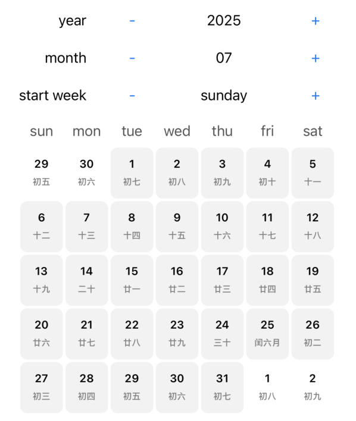

# ⭐️⭐️⭐️please star ⭐️⭐️⭐️
# SYCalendar
Calendar

With the calendar data source, it is very simple whether using UIKit or SwiftUI.

```
let tool = CalendarTool(start: "2025-04-01", startWeek: .sunday)
// The array contains the data of the month of "2025-04-01" 
// (including the supplemented parts of the previous and next months)
let arr = tool.getDaysInMonthArr()
```

